# 🚀 Giuseppe Esteban Quintero Rojas

<div align="center">
  
  [](https://git.io/typing-svg)
  
  ### 💡 *"Code is poetry, data tells stories, and every bug is just a feature waiting to be discovered"*
  
  🔍 **Currently seeking opportunities** • 💼 **Open to internships** • 🤝 **Ready to collaborate**
  
  [](https://www.linkedin.com/in/giuseppe-esteban-quintero-rojas-2155a0332/)
  [](mailto:giuseppeesteban101@gmail.com)
  
</div>

---

## 🎯 About Me

```python
class Giuseppe:
    def __init__(self):
        self.name = "Giuseppe Esteban Quintero Rojas"
        self.title = "Software Analysis & Development Technologist"
        self.location = "Colombia 🇨🇴"
        self.current_focus = ["Full Stack Development", "Data Analysis", "System Optimization"]
        self.status = "Actively seeking opportunities"
        
    def get_passion(self):
        return "Transforming ideas into scalable solutions through clean code and data-driven insights"
        
    def current_goals(self):
        return [
            "🎯 Land my first professional role",
            "📈 Master advanced Python frameworks", 
            "🤝 Contribute to open source projects",
            "📊 Deepen data science expertise"
        ]
```

---

## 🛠️ Tech Arsenal

<div align="center">

### 💻 Languages


### 🎨 Frameworks & Libraries


### 🗄️ Databases & Tools


### 🎨 Design & Cloud


</div>

---

## 🎖️ Featured Projects

<div align="center">

### 🍴 GastroBar Management System
*Complete restaurant management solution*

```mermaid
graph LR
    A[🏪 Restaurant] --> B[📋 Order Management]
    A --> C[🪑 Table Control]  
    A --> D[📦 Product Management]
    B --> E[📊 Reports & Analytics]
    C --> E
    D --> E
    
    style A fill:#e1f5fe
    style E fill:#f3e5f5
```



**Tech Stack:** `HTML` `CSS` `JavaScript` `SQL` `Testing & QA`
- 🎯 Streamlined restaurant operations with integrated POS system
- 📈 Implemented comprehensive reporting dashboard
- 🧪 Conducted thorough testing for optimal performance

---

### 📊 Retail Analytics System *(In Development)*
*Real-time sales data processing and visualization*

```mermaid
graph TD
    A[🛒 Sales Data] --> B[🐍 Python Processing]
    B --> C[📊 Pandas Analysis]
    B --> D[🎨 Matplotlib Visualization] 
    C --> E[💾 SQLAlchemy ORM]
    D --> F[📈 Business Intelligence]
    E --> F
    
    style A fill:#e8f5e8
    style F fill:#fff3e0
```



**Tech Stack:** `Python` `Pandas` `Matplotlib` `SQLAlchemy`
- ⚡ Real-time sales trend identification
- 📦 Inventory optimization algorithms  
- 🎯 Data-driven business insights

[](https://github.com/GiuseppeQuintero17/Proyecto-ombu-sena)

</div>

---

## 📈 GitHub Analytics

<div align="center">
  
  
  
  
  
  
  
</div>

---

## 🎯 Current Focus Areas

<table align="center">
<tr>
<td align="center" width="33%">

**🚀 Job Hunting**
```
Status: Active
Goal: Full Stack Role
Timeline: Immediate
```

</td>
<td align="center" width="33%">

**📚 Learning Path**  
```
Currently: Advanced Django
Next: React Integration
Future: AWS/Azure
```

</td>
<td align="center" width="33%">

**🤝 Networking**
```
Open to: Mentorship
Seeking: Collaboration
Ready for: Internships
```

</td>
</tr>
</table>

---

## 🏆 Professional Philosophy

<div align="center">

```javascript
const giuseppe = {
    mindset: "Growth-oriented",
    approach: "Problem-solving through code",
    values: ["Clean Code", "Continuous Learning", "Team Collaboration"],
    goal: "Creating impactful solutions that make a difference"
};

console.log(`${giuseppe.mindset} developer ready to contribute! 💪`);
```

</div>

---

## 📬 Let's Connect!

<div align="center">
  
  **Ready to discuss opportunities, share ideas, or collaborate on exciting projects?**
  
  [](https://www.linkedin.com/in/giuseppe-esteban-quintero-rojas-2155a0332/)
  [](mailto:giuseppeesteban101@gmail.com)
  

</div>
